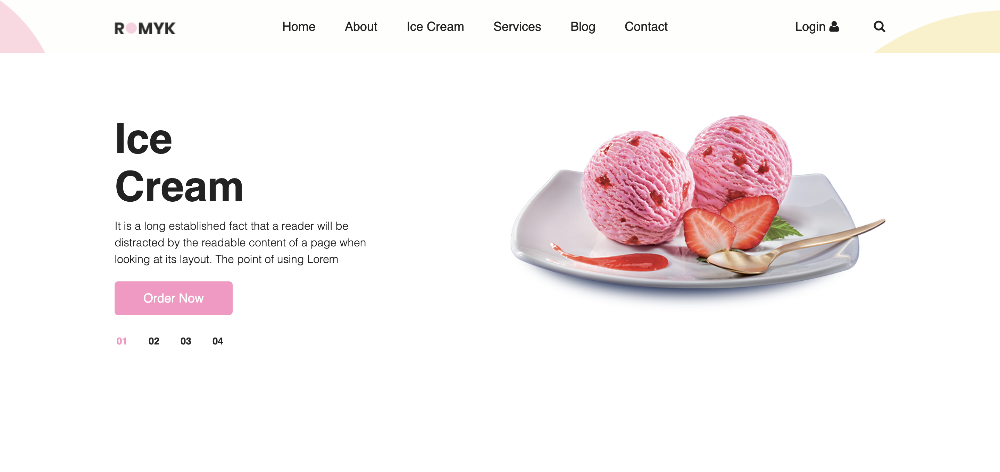

Here’s a ready-to-go simple README.md template you can use for your Django Ice Cream project:

# 🍨 Django Ice Cream Website

This is a simple Django project showcasing an Ice Cream website with multiple pages like Home, About, Services, Blog, Contact, and more. It uses **Django**, **Bootstrap 5**, and static files for styling.

---

## 🚀 Features

- Home, About, Services, Ice Cream, Contact, Blog Pages
- Mobile Responsive Design (Bootstrap)
- Clean Django Structure (Base Template + Multiple Pages)
- Easy to Expand & Customize

---

## 📂 Project Structure

Ice_cream/
├── ice_cream/          # Django project
├── website/            # Django app (views, urls)
├── templates/          # HTML templates (base.html, home.html etc.)
├── static/             # CSS, JS, Images
└── manage.py

---

## 🛠️ Setup Instructions

1. **Clone the Repository**
```bash
git clone https://github.com/himanshu263/ice_cream_hub.git
cd ice_cream_hub

	2.	Create Virtual Environment

python -m venv venv
source venv/bin/activate   # Mac/Linux
venv\Scripts\activate      # Windows

	3.	Install Requirements

pip install -r requirements.txt

	4.	Run the Server

python manage.py runserver

Visit: http://127.0.0.1:8000/

⸻

💡 Pages Overview

Page	URL
Home	/
About	/about/
Services	/services/
Ice Cream	/ice-cream/
Blog	/blog/
Contact	/contact/


⸻

📸 Screenshots

Add your website screenshots here.

⸻

🤝 Contributing

Pull requests are welcome. For major changes, open an issue first to discuss what you would like to change.

⸻


📧 Contact

Made with ❤️ by Himanshu Yadav
GitHub: himanshu263
LinkedIn: Himanshu Yadav

---

If you want I can generate the file and attach it as download too—just tell me!
